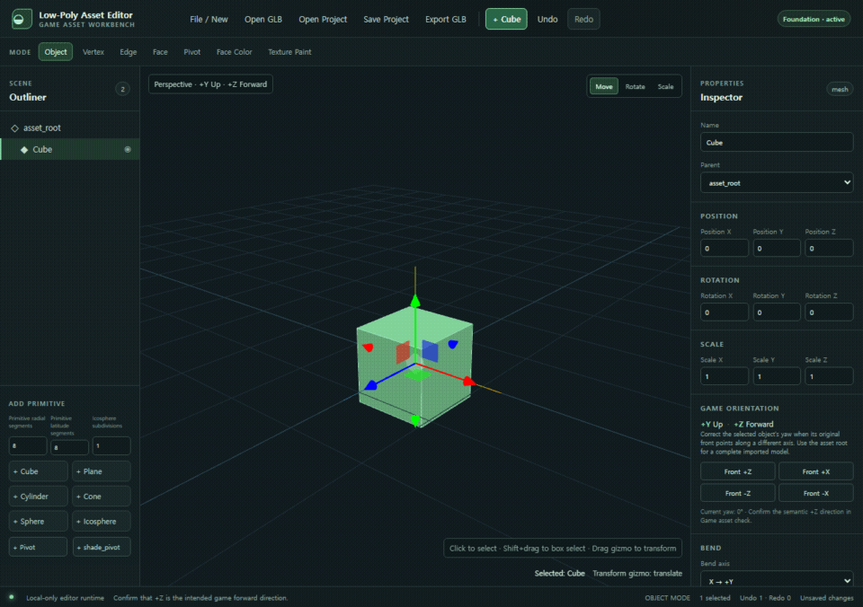
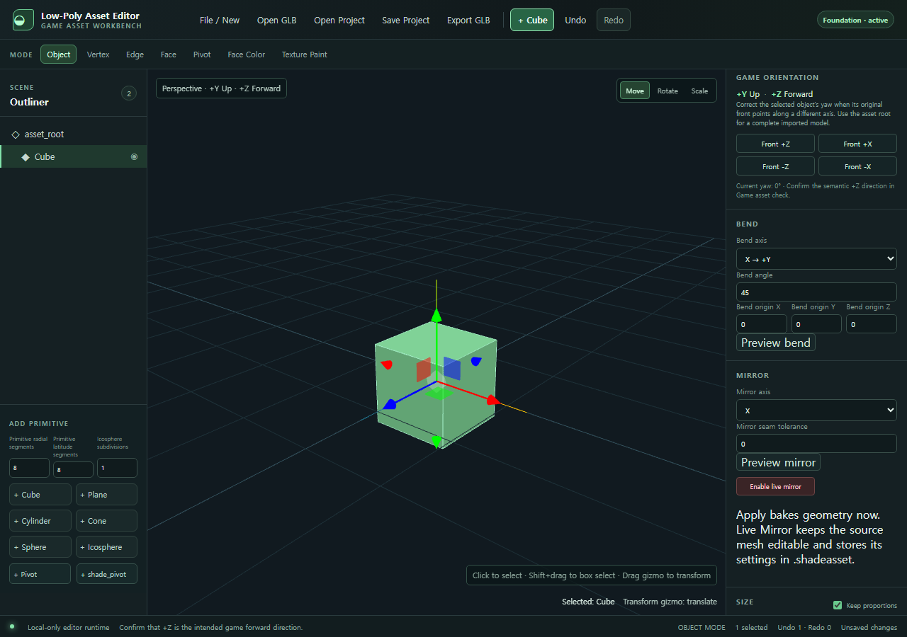

# Low-Poly Asset Editor

`Who Ordered Some Shade? / 그늘 시키신 분?`에 사용할 로우폴리 GLB 에셋을 브라우저에서 만들고 정리하는 데 초점을 둔 데스크톱 우선 3D 에디터입니다.

Blender를 대체하는 범용 DCC 도구가 아닙니다. Primitive에서 간단한 게임 에셋을 만들거나, Meshy 등으로 생성한 GLB에서 불필요한 부분을 제거하고 게임용 크기·피벗·재질로 정리하는 작업에 맞춥니다.



## 주요 기능

- Cube, Plane, Cylinder, Cone, Sphere, Icosphere 생성
- Object / Vertex / Edge / Face 편집, 다중 선택, Undo / Redo
- Merge, Delete, Subdivide, Loop Cut, Extrude, Inset, Bevel, Mirror, Bend
- 실제 vertex geometry를 바꾸는 W/H/D 크기 조절과 Apply Scale
- hierarchy 편집, Pivot, `shade_pivot`, Ground, Shadow Preview
- Face Color, PBR 재질 편집, Flat / Smooth shading, topology 검사·간단한 repair
- GLB 열기·드래그 앤 드롭·내보내기·재열기 안전 검증
- Boolean Difference / Union / Intersection (closed manifold mesh 전용)
- Texture Paint, 간단한 Auto UV, local texture import
- 편집 상태를 위한 `.shadeasset` v2 Save / Open

모든 GLB, 이미지, 프로젝트 파일은 브라우저에서 로컬로만 읽고 처리합니다. 서버, 계정, 외부 API가 없습니다.

## 빠른 시작

필수 환경: Node.js 24 이상

```bash
npm install
npm run dev
```

표시된 로컬 주소를 브라우저에서 열고 `+ Cube`를 누르면 바로 시작할 수 있습니다.

자세한 사용 흐름은 [사용 설명서](USER_GUIDE.md)를 참고하세요.

## 파일 형식

| 용도            | 형식                                | 설명                                                                                        |
| --------------- | ----------------------------------- | ------------------------------------------------------------------------------------------- |
| 가져오기        | `.glb`                              | 편집·정리할 게임 모델                                                                       |
| 작업 저장       | `.shadeasset`                       | hierarchy, editable mesh, Mirror 상태, palette, texture payload 등을 보존하는 프로젝트 파일 |
| 게임용 내보내기 | `.glb`                              | 숨긴 node를 제외하고 검증 후 다운로드하는 최종 에셋                                         |
| Texture Paint   | 브라우저가 읽을 수 있는 로컬 이미지 | PNG/JPEG/WebP 등을 PNG/sRGB paint payload로 변환                                            |

`.shadeasset`은 작업 재개용 파일이고, 게임에 넣을 결과물은 `.glb`입니다.

## 권장 작업 흐름

### 직접 제작

1. Primitive를 추가합니다.
2. Vertex / Edge / Face mode에서 형태를 만듭니다.
3. Face Color 또는 Material로 색과 질감을 정리합니다.
4. W/H/D로 실제 크기를 지정하고 필요하면 Apply Scale을 실행합니다.
5. `shade_pivot`, Ground, Shadow Preview, Game Asset Check를 확인합니다.
6. GLB를 내보냅니다.

### Meshy GLB 후처리

1. `Open GLB` 또는 viewport 드래그 앤 드롭으로 파일을 엽니다.
2. Outliner에서 불필요한 mesh를 삭제하고 hierarchy를 정리합니다.
3. topology 도구와 Face Color / Material로 형태와 색을 수정합니다.
4. 크기, 방향, Ground, Pivot을 게임 기준에 맞춥니다.
5. 검증 경고를 확인한 뒤 GLB를 내보냅니다.



## 개발 명령

```bash
# 코드 검사
npm run format:check
npm run lint
npm run typecheck

# 테스트
npm test
npm run test:e2e

# 배포용 빌드
npm run build
npm run build:pages
```

## GitHub Pages 배포

`.github/workflows/deploy-pages.yml`이 `main` branch push와 수동 실행에 맞춰 GitHub Pages artifact를 만들고 배포합니다. Vite base path는 GitHub Pages가 제공하는 repository path를 사용하므로 project page 경로에서도 asset과 WASM 파일을 올바르게 읽습니다.

처음 한 번만 GitHub 저장소에서 다음을 설정하세요.

1. **Settings → Pages → Build and deployment → Source**를 **GitHub Actions**로 선택합니다.
2. `main`에 push하거나 **Actions → Deploy GitHub Pages → Run workflow**를 실행합니다.
3. workflow의 `deploy` job이 완료되면 GitHub가 Pages URL을 표시합니다. 이 저장소의 기본 project-page 주소는 `https://wonjinyi.github.io/lowpoly-modeler/`입니다.

로컬에서 동일한 하위 경로 build를 확인하려면 다음을 실행합니다.

```bash
npm run build:pages
npm run preview -- --mode pages
```

자동 배포는 `main` push에만 실행되며, pull request에서는 [Quality workflow](.github/workflows/quality.yml)가 검사와 Pages build만 수행합니다.

## 검증 상태

- Vitest unit test 84개 통과
- Playwright Chromium E2E 49개 통과
- lint, typecheck, format, production build, GitHub Pages build 통과
- GitHub Pages 하위 경로의 정적 preview에서 새 세션 실행 확인

성능 기준과 측정 대상은 [performance-budget.md](performance-budget.md)에 기록되어 있습니다.

## 범위와 제한

- Desktop browser를 우선 지원합니다.
- GLB만 직접 import합니다. `.gltf`는 아직 지원하지 않습니다.
- Boolean은 닫히고 일관된 winding을 가진 manifold solid에서만 동작합니다. 결과는 triangle mesh이며 source subject의 기본 material ID를 사용합니다.
- Auto UV는 low-poly 편집을 위한 단순 face-projection 방식입니다. UV packing이나 Blender식 UV Editor는 제공하지 않습니다.
- Sculpt, Rigging, Animation, Skinning, Cloth/Physics, Shader Nodes, CAD, 자동 retopology는 범위 밖입니다.

## 문서

- [사용 설명서](USER_GUIDE.md) — 실제 에디터 작업 순서와 도구별 안내
- [개발 계획 및 완료 체크리스트](codex-development-plan.md)
- [개발 지시서](codex-development-instruction.md)
- [Boolean 기술 검증 기록](boolean-technology-spike.md)
- [성능 예산](performance-budget.md)

## 라이선스

[MIT License](LICENSE)
