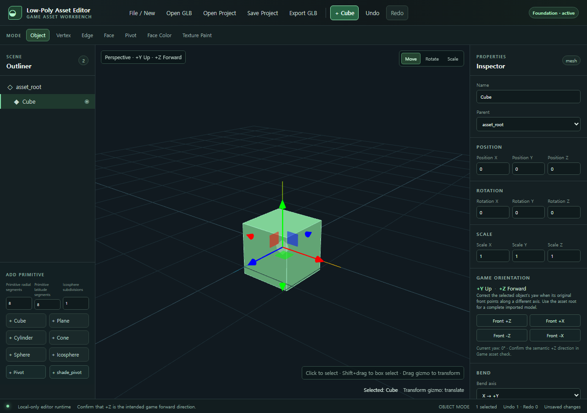
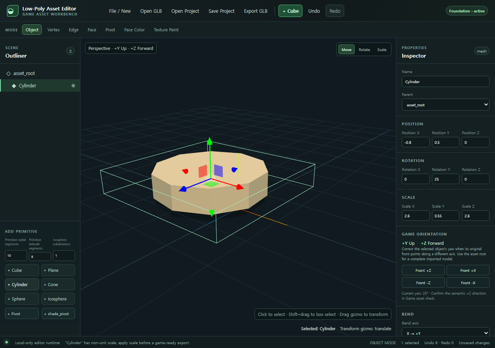
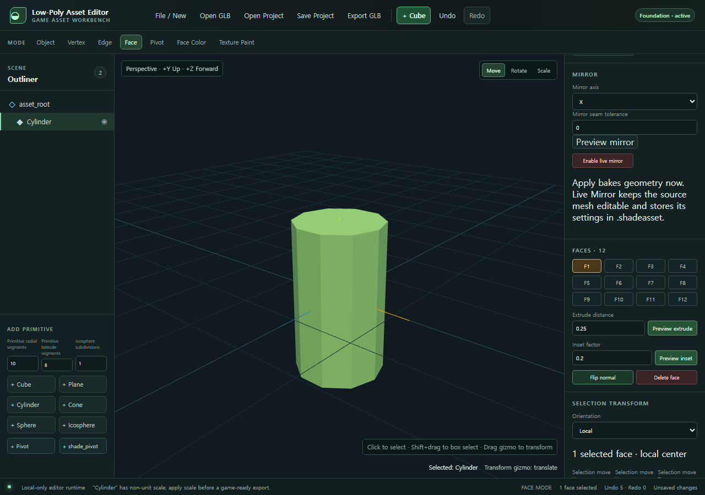
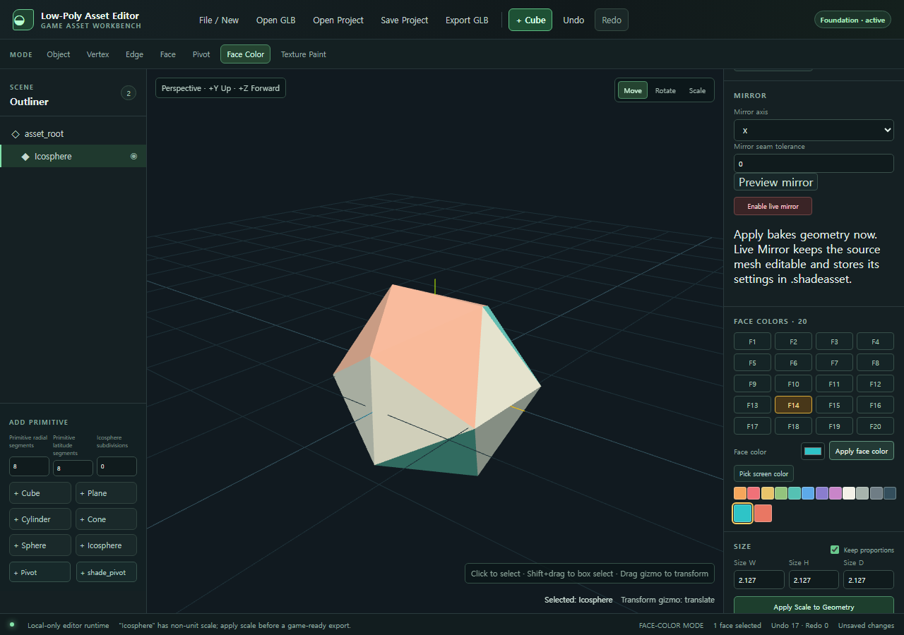

# Low-Poly Asset Editor 사용 설명서

## 1. 시작하기

에디터를 열면 좌측 Outliner, 중앙 3D Viewport, 우측 Inspector, 하단 Status / Validation 영역이 보입니다.

1. 새 에셋을 만들려면 상단 `+ Cube` 또는 우측 Primitive 버튼을 누릅니다.
2. 기존 모델을 열려면 `Open GLB`를 누르거나 `.glb` 파일을 viewport 위로 끌어 놓습니다.
3. Outliner에서 object를 선택하면 Inspector에서 해당 object의 transform, geometry, material, topology 도구를 볼 수 있습니다.
4. 변경은 모두 Undo / Redo에 기록됩니다.

작업 중인 상태를 남기려면 `Save Project`로 `.shadeasset`을 저장합니다. 게임에 넣을 파일은 `Export GLB`로 만듭니다.

아래는 Primitive 추가, Transform, Face Color만으로 비대칭 저폴리 분수를 만드는 실제 작업 예시입니다. 설명서의 개별 기능을 읽기 전 전체 흐름을 먼저 확인할 수 있습니다.

## 2. 기본 조작

| 작업               | 방법                                                              |
| ------------------ | ----------------------------------------------------------------- |
| Object 선택        | Viewport에서 클릭 또는 Outliner에서 선택                          |
| 다중 선택          | `Shift`를 누른 채 클릭                                            |
| 영역 선택          | Vertex / Edge / Face mode에서 `Shift`를 누른 채 viewport를 드래그 |
| 이동 / 회전 / 크기 | 상단 Transform 도구 또는 Inspector 수치 입력                      |
| Undo               | `Ctrl/Cmd + Z`                                                    |
| Redo               | `Ctrl/Cmd + Shift + Z` 또는 `Ctrl/Cmd + Y`                        |
| 선택 삭제          | `Delete` 또는 `Backspace`                                         |

수치 입력은 값을 적고 `Enter`를 누르거나 다른 곳을 클릭하면 적용됩니다. `Esc`는 입력 중인 값을 되돌립니다.

아래처럼 Object mode에서 선택한 primitive의 위치, 회전, Scale을 오른쪽 Inspector에서 바로 확인·수정할 수 있습니다. Gizmo는 viewport에서 빠르게 움직일 때, 수치 입력은 정확한 배치가 필요할 때 사용하세요.

## 3. Mode별 작업

### Object

Object를 선택·이동·회전·scale 합니다. Outliner에서 이름 변경, 표시/숨김, 삭제, parent / unparent도 할 수 있습니다.

Object Scale은 작업 중 임시 transform입니다. 게임용 실제 크기는 아래의 `Size` 도구로 조절하세요.

### Vertex

Vertex를 선택해 좌표를 수정하거나, 여러 vertex를 Merge / Merge by Distance / Delete할 수 있습니다. Selection Transform에서 Local 또는 World 기준의 이동·회전·크기 변경도 가능합니다.

### Edge

Edge를 선택해 Subdivide, Delete, Dissolve, Bevel을 수행합니다. quad topology에서는 선택 edge를 기준으로 Loop Cut preview를 만들고 위치를 조절한 뒤 적용할 수 있습니다.

GLB는 triangle mesh로 저장되므로, imported triangle pair는 먼저 `Tris to Quads` 조건을 만족해야 Loop Cut 대상이 됩니다. UV seam, 재질 seam, pole, non-manifold 구간은 안전을 위해 거부됩니다.

### Face

Face를 선택해 Delete, Flip Normal, Extrude, Inset을 수행합니다. Face Delete는 열린 구멍을 만드는 가장 직접적인 방법입니다.

Face를 하나 선택하면 오른쪽에 Extrude와 Inset 입력이 나타납니다. 먼저 `Preview`로 결과를 확인하고, 맞으면 Commit하여 하나의 Undo 작업으로 저장하세요.

### Pivot

Pivot group을 생성하고 위치·이름을 바꿀 수 있습니다. `shade_pivot`은 게임에서 회전시킬 부분의 권장 이름입니다.

회전 preset 또는 slider로 결과를 미리 본 뒤 Apply하면 하나의 Undo 작업으로 저장됩니다. preview만으로는 실제 document가 바뀌지 않습니다.

### Face Color

Viewport에서 face를 클릭해 색칠하거나, 선택된 face에 palette / color picker의 색을 적용합니다. 색은 vertex/corner color로 저장하므로 face 수만큼 material이 늘어나지 않습니다.

면 목록에서 정확한 면을 고른 뒤 palette 또는 color picker로 색을 정하고 `Apply face color`를 누릅니다. 이 화면처럼 같은 Icosphere에 여러 색을 섞어도 material은 하나로 유지됩니다.

### Texture Paint

UV가 있는 mesh 위에서 Brush, Eraser, Eyedropper를 사용할 수 있습니다.

1. UV가 없다면 `Generate simple Auto UV`를 누릅니다. 기존 UV는 덮어쓰지 않습니다.
2. `Create blank layer` 또는 `Import local image`로 editable texture를 준비합니다.
3. Brush 색, 크기, 불투명도를 정합니다.
4. `Texture Paint` mode로 전환한 뒤 viewport 위를 드래그합니다.

한 번의 stroke는 하나의 Undo 작업입니다. UV의 0/1 경계를 넘는 brush는 반대쪽 경계에도 이어지도록 처리됩니다.

## 4. 실제 크기와 게임 좌표

### Size (W / H / D)

Inspector의 `Size W/H/D`는 Object Scale 숫자가 아니라 vertex geometry 자체를 바꿉니다. 기본값인 `Keep proportions`가 켜진 상태에서는 축 하나만 바꿔도 나머지 축이 같은 비율로 바뀝니다.

게임에 내보낼 모델은 object scale이 `1 / 1 / 1`인 상태를 권장합니다. 이미 Object Scale을 사용했다면 `Apply Scale to Geometry`를 실행하세요.

### 방향과 바닥

- 게임 좌표 기준은 `+Y = Up`, `+Z = Forward`입니다.
- Ground panel의 `Move selection to ground`는 선택한 object/subtree의 바닥을 ground reference에 맞춥니다.
- `Set Ground Reference`로 현재 선택한 바닥 높이를 기준값으로 저장할 수 있습니다.
- Shadow Preview는 ground, directional light, cast/receive shadow로 silhouette을 확인하는 보기 모드입니다.

Inspector의 Bend와 Mirror는 선택 object의 비파괴 preview를 제공합니다. preview가 맞을 때만 Apply/Bake하여 실제 geometry로 확정하세요.

## 5. Material과 Cleanup

Material panel에서 Base Color, Roughness, Metalness, Opacity, Flat Shading을 조절합니다. 낮은 roughness나 높은 metalness는 의도적으로 사용하지 않는 한 게임용 low-poly asset에는 보통 필요하지 않습니다.

Topology panel은 다음을 검사합니다.

- Open edge, non-manifold edge, inconsistent normal
- Degenerate face, duplicate / coincident vertex
- 작은 loose component

문제가 있다면 Merge by Distance, Recalculate Normals, Delete Degenerate Faces 또는 loose component 분리/삭제를 사용합니다. repair도 Undo할 수 있습니다.

## 6. Boolean으로 관통 구멍 만들기

Boolean은 Face Delete와 달리 실제 volume을 깎거나 합칩니다.

1. subject가 될 mesh를 먼저 선택합니다.
2. cutter가 될 mesh를 `Shift`로 두 번째 선택합니다.
3. Inspector의 Boolean panel에서 Difference, Union, Intersection 중 하나를 선택하고 Preview를 실행합니다.
4. 결과가 맞으면 Commit합니다. 취소하려면 Cancel Boolean preview를 누릅니다.

안전 규칙:

- 두 object 모두 closed manifold solid여야 합니다. 열린 plane, non-manifold, degenerate geometry는 먼저 repair해야 합니다.
- Live Mirror가 켜진 mesh는 먼저 bake하거나 끕니다.
- cutter에는 child object가 있으면 안 됩니다. Commit 시 cutter object가 제거됩니다.
- Preview 중에는 source geometry가 바뀌지 않습니다. Commit은 하나의 Undo 작업입니다.
- Boolean 결과는 triangle mesh이며 source subject의 첫 material을 사용합니다. 정교한 다중 재질/UV 재투영은 이 버전의 범위 밖입니다.

## 7. 파일 저장과 내보내기

### GLB 열기

`Open GLB` 또는 drag & drop을 사용합니다. animation, skinning, morph target처럼 정적 low-poly 편집 범위를 벗어난 정보는 경고와 함께 현재 형태로 가져옵니다.

### Project 저장

`Save Project`는 `.shadeasset`을 다운로드합니다. 이 파일에는 editable mesh, hierarchy, selection 가능한 topology, palette, texture paint payload, live Mirror, editor 설정이 들어갑니다.

`Open Project`로 다시 열면 안전한 새 Undo 기준점에서 작업을 이어갑니다.

### 게임용 GLB 내보내기

`Export GLB`는 다음을 검사합니다.

- export할 visible mesh가 있는지
- geometry와 texture 참조가 유효한지
- transform이 유한한지
- non-unit scale, ground contact, `shade_pivot`, +Z forward 확인 상태

Error는 내보내기를 막습니다. Warning은 내용을 확인한 후 계속하거나 취소할 수 있습니다. 내보내기 전에는 메모리에서 GLB를 다시 열어 visible mesh 수, bounds, scale, hierarchy를 안전 검증합니다.

## 8. 문제 해결

| 증상                       | 확인할 사항                                                                                                                 |
| -------------------------- | --------------------------------------------------------------------------------------------------------------------------- |
| Size가 바뀌지 않음         | 선택 object의 local size/scale 축이 0인지 확인하고 먼저 0이 아닌 값으로 복구합니다.                                         |
| Loop Cut이 거부됨          | triangle, pole, UV/material seam, boundary/non-manifold 구간일 수 있습니다. Tris to Quads 또는 다른 편집 도구를 사용합니다. |
| Boolean preview가 실패함   | 두 mesh가 closed manifold인지, Live Mirror가 꺼져 있는지, cutter에 child가 없는지 확인합니다.                               |
| Texture Paint를 쓸 수 없음 | UV를 만들거나 기존 UV가 있는 mesh를 선택하고 blank/imported texture를 준비합니다.                                           |
| Export가 막힘              | 하단 Game Asset Check의 Error 항목을 수정합니다. Warning은 게임 의도에 맞는지 확인한 뒤 export할 수 있습니다.               |
| 작업을 잃을까 걱정됨       | GLB export 전후와 큰 작업 전에 `.shadeasset`으로 저장합니다.                                                                |

## 9. 현재 범위 밖 기능

이 에디터는 간단한 게임 asset 제작에 집중합니다. Sculpt, Rigging, Animation 편집, Skinning, Cloth/Physics, Shader Node Editor, 정밀 UV 편집/packing, CAD, 자동 retopology는 제공하지 않습니다.

개발·검증 정보는 [README](README.md), [개발 계획](codex-development-plan.md), [성능 예산](performance-budget.md)에서 확인할 수 있습니다.
